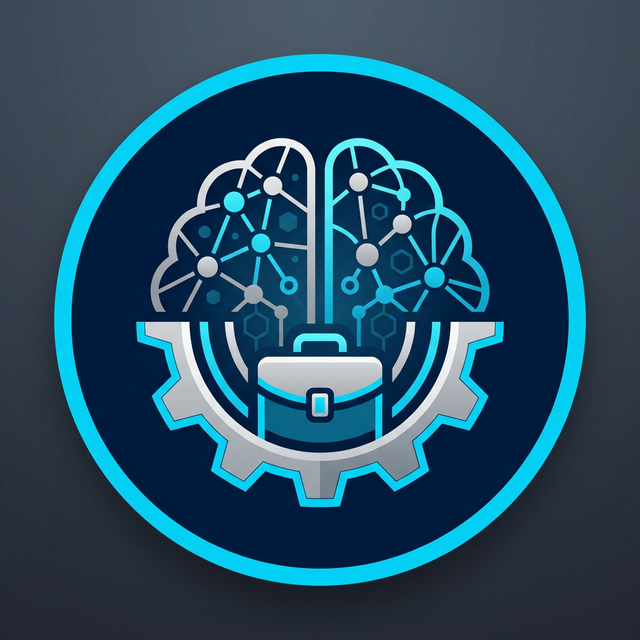

# 🤖 RAG + MCP Business Agent

An autonomous, state-of-the-art AI assistant for Telegram, built with **LangGraph**, **Groq (Llama 3.3)**, **ChromaDB**, and **Model Context Protocol (MCP)**.



## 🌟 Key Features

- **🧠 Autonomous Reasoning**: Powered by LangGraph and Llama 3.3, the agent thinks step-by-step to solve complex business queries.
- **📚 RAG (Retrieval-Augmented Generation)**: Private knowledge base using ChromaDB and local HuggingFace embeddings.
- **🛠️ MCP Toolset**: Comprehensive tool integration for real-world actions:
    - **Database**: SQLite customer record search.
    - **Email**: Automated Gmail sending via App Passwords.
    - **Ticketing**: Local issue tracking system.
- **🌐 Real-Time Web Search**: Integrated DuckDuckGo search for current events and global data.
- **🛡️ Human-in-the-Loop (HITL)**: Safety first! Sensitive actions (like emails or payments) require manual approval via Telegram buttons.
- **💾 Persistent Memory**: Remembers user context and conversation history across sessions.
- **📊 Business Intelligence (Simulated)**: Ready-to-use simulations for **Stripe**, **Shopify**, and **Google Calendar**.

## 🚀 Quick Start

### 1. Prerequisites
- Python 3.10+
- A [Groq API Key](https://console.groq.com/)
- A [Telegram Bot Token](https://t.me/botfather)

### 2. Installation
```powershell
# Clone the repository
git clone <your-repo-url>
cd business-agent-telegram

# Install dependencies
pip install -r requirements.txt
```

### 3. Configuration
Create a `.env` file in the root directory:
```env
TELEGRAM_BOT_TOKEN=your_token_here
GROQ_API_KEY=your_key_here
GMAIL_SENDER=your_email@gmail.com
GMAIL_APP_PASSWORD=your_16_char_app_password
```

### 4. Running the Agent
```powershell
# Ingest initial documents
python -m rag.ingest

# Start the bot
python main.py
```

## 🤖 Telegram Commands
- `/start`: Initialize the agent.
- `/help`: List available capabilities.
- `/status`: Check system health (DB, Docs, LLM).
- `/ingest`: Manually trigger a refresh of the knowledge base.

## 🛠️ Project Structure
- `bot_interface/`: Telegram handlers and UI logic.
- `agent/`: Core reasoning (LangGraph), state management, and tool definitions.
- `rag/`: Document processing and vector storage.
- `mcp_server/`: Tool implementations and database logic.
- `agent.log`: Live audit logs of agent actions.

## 📜 License
MIT
